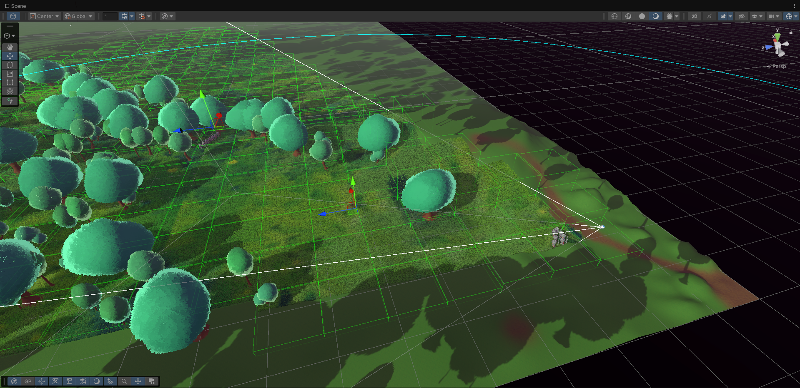
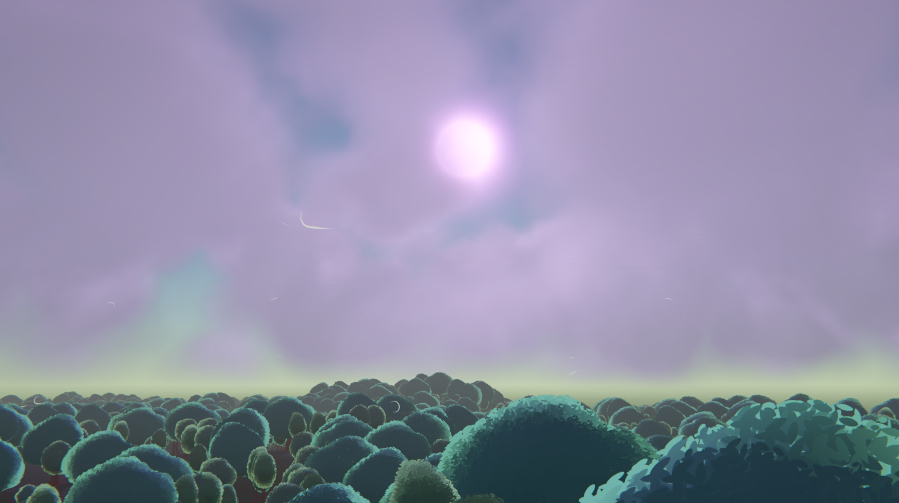
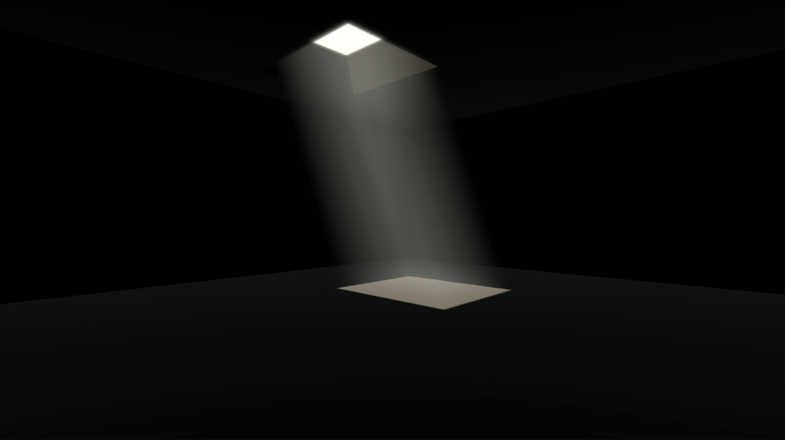

<h2>🌱 Grass Rendering & GPU Culling</h2>

A fully custom grass rendering system designed for large-scale environments, combining CPU and GPU culling with procedural generation and GPU-driven rendering.

<h3>🧩 GPU Culling</h3>

  

The grass system uses a <b>hybrid culling approach</b> to efficiently handle large amounts of vegetation.

<ul>
  <li>CPU culling operates on spatial grass chunks</li>
  <li>Chunks support different sizes and variable grass height</li>
  <li>Invisible or distant chunks are fully discarded on the CPU</li>
  <li>Visible chunks are processed further on the GPU</li>
</ul>

This significantly reduces CPU overhead while keeping GPU workloads tightly bounded.

<h3>🌿 Grass Rendering</h3>

  
  

Grass instances are generated <b>automatically from terrain data</b>.
The system supports multiple terrain layers, allowing different grass types, densities, and visual parameters per layer.

<ul>
  <li>Layer-based procedural generation</li>
  <li>Consistent distribution across large terrains</li>
  <li>Per-layer control over density and height</li>
</ul>

Rendering is fully GPU-driven using <b>Graphics.DrawMeshInstancedIndirect</b>, enabling large instance counts with minimal CPU cost.

<h3>🍃 Grass Bending</h3>

  

Wind animation is implemented as a <b>three-band system</b>, providing natural and scalable motion.

<ul>
  <li>Low-frequency global wind</li>
  <li>Mid-frequency directional movement</li>
  <li>High-frequency local noise for detail</li>
</ul>

Color variation is driven by a <b>color map</b> combined with three additional tint colors:

<ul>
  <li>Root tint</li>
  <li>Mid-section tint</li>
  <li>Tip tint</li>
</ul>

This approach adds depth and variation while avoiding visible repetition.

<h2>☁️ Volumetric Clouds</h2>

  

A real-time volumetric cloud system implemented as a <b>ScriptableRendererFeature</b>, focused on artistic flexibility and performance.

<ul>
  <li>Raymarch-based volumetric rendering</li>
  <li>Custom 3D textures for cloud shape and fine detail</li>
  <li>Additional noise textures and jitter for variation</li>
</ul>

  
  

The system includes tools for generating and tuning the 3D textures used for cloud form and detail layers.
Lighting supports adjustable sun influence and cloud coloration.

Cloud movement is controlled via a configurable wind system with parameters for direction and strength.

<h2>💡 Volumetric Light</h2>

  

A custom volumetric lighting solution built using a <b>ScriptableRendererFeature</b>, designed for cinematic light shafts and atmospheric depth.

  

The effect is composed of four main rendering passes:

<ol>
  <li><b>Raymarch Pass</b> – computes volumetric light scattering</li>
  <li><b>Horizontal Blur</b> – reduces noise</li>
  <li><b>Vertical Blur</b> – reduces noise</li>
  <li><b>Composite Pass</b> – blends the result with the scene</li>
</ol>

<ul>
  <li>Optional render target downscaling for performance</li>
  <li>Jitter-based sampling to reduce raymarch steps</li>
  <li>Blur passes used to hide sampling artifacts</li>
</ul>

<b>Technologies:</b> Unity · URP · HLSL · Compute Shaders · GPU Instancing · ScriptableRendererFeature

